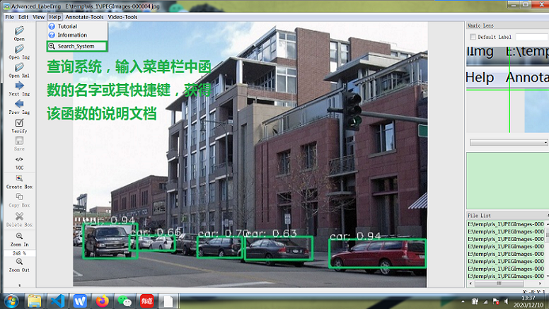
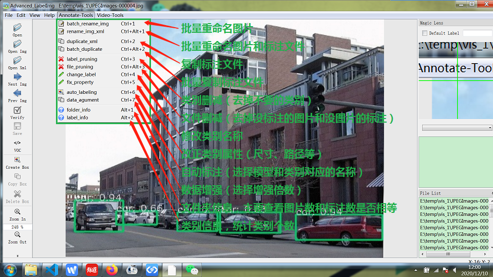
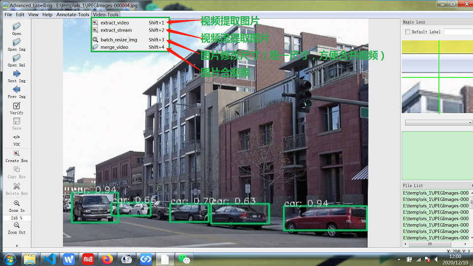

# 升级版LabelImg

### 在labelImg的基础上，增加了多种批量处理的工具，同时增加了查询系统，对于新加的功能可以查询获得说明和使用方式。具体如下：
- 批量修改文件(图片和标注文件)
- 标注复制(复制上一个图片的标注框)
- 类别查删改(统计当前类别个数信息，去掉不要的类别，或修改类别名称)
- 标注文件属性矫正(尺寸、路径等等)
- 文件删减(删除没有标注的图片和没有图片的标注)
- 自动标注(使用模型进行标注，标注效果视模型性能好坏，一般需要人工在过一遍)
- 数据增强(随机使用平移，翻转，缩放，亮度，gama，模糊等手段增强图片)
- 图片提取和视频合成
- 查询系统(输入关键字获得说明信息)
- 放大功能(界面右端预留了一个放大镜，对小目标的标注有帮助)

### 安装：

1. 复制仓库：  `git clone https://github.com/wufan-tb/improved-LabelImg`

2. 安装依赖：  `pip install requirements.txt`

3. labelImg 编译：  `sudo apt-get install pyqt5-dev-tools`  
`make qt5py3`  
这里只给了Ubuntu系统的，其他系统可参考LabelImg原版软件[labelImg](https://github.com/tzutalin/labelImg)的安装教程

4. 可选步骤，Retinanet编译： 
`cd keras_retinanet`  
`python setup.py build_ext --inplace`  
`cd ..`  
`mv {your_model_weight.h5} keras_retinanet/weights/`  
编译过程可参考[keras-retinanet](https://github.com/fizyr/keras-retinanet), 官方模型也可以在里面下载

5. 可选步骤，准备Yolov5模型： 
`mv {your_model_weight.pt} pytorch_yolov5/weights/`  
官方模型获取参考[Yolov5](https://github.com/ultralytics/yolov5)

6. 完成1,2,3步骤后，输入  `python labelImg.py` 打开软件开始标注。

* 其中4，5步骤并非必须，若要使用自动标注工具则需要进行 

### Demo:

一些示意图，具体说明可参考软件中的查询系统：

##### 查询系统：

##### 标注工具:

##### 视频工具:

